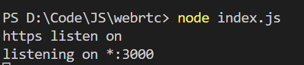
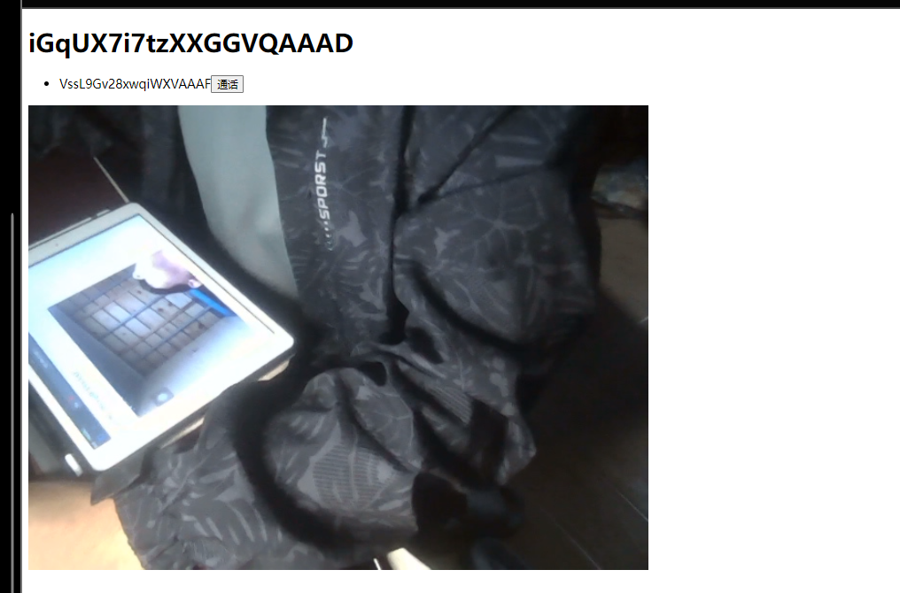
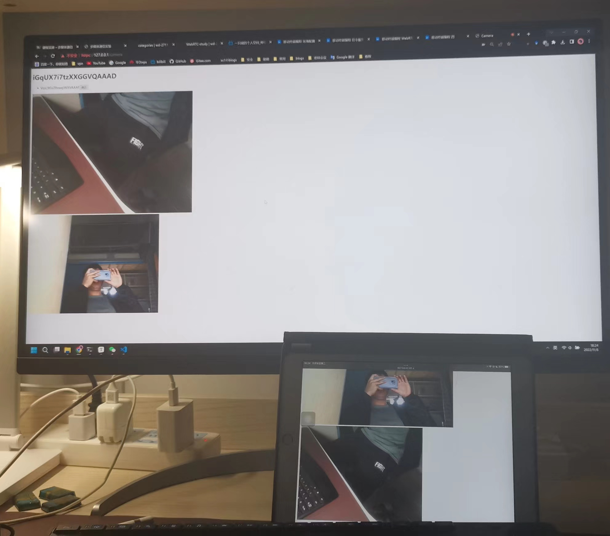

# webRTC-demo

参考一只斌师傅的 webrtc 教程完完整整的复现来的，链接如下：

https://www.bilibili.com/video/BV1py4y1e7G6/?spm_id_from=333.999.0.0&vd_source=270df07e19daab36f36e1863f3440455

## 配置

```
确保安装nodejs
npm init //创建初始项目
npm install express // 安装express
npm install socket.io
```

## 运行效果

​	输入"node index.js"并开始运行。



​	保证视频通信的双方连一个局域网，否则访问不到页面。

​	两台设备访问 https://192.168.43.185/camera，如下图所示：



​	其中 iGxxxAAAD为此设备的ID，VssxxxAAAF为远程设备的ID。

​	点击通话，效果如下图所示：

